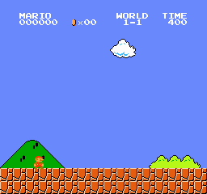

# 🍄 PPO Agent for Super Mario Bros

A PyTorch implementation of **Proximal Policy Optimization (PPO)** trained on the Super Mario Bros NES environment. This project is part of a Final Year Project at **Macau University of Science and Technology**, conducting a comparative study between PPO and Double DQN algorithms on classic Atari-style game environments.

---

## 📺 Demo



> The agent achieves a **74.6% overall clear rate** on World 1-1, reaching **94.6%** in the final training phase.

---

## 📁 Project Structure

```
mario_PPO/
├── src/
│   ├── __init__.py             # Package initializer
│   ├── env.py                  # Environment wrappers, preprocessing, reward shaping
│   └── ppo.py                  # MarioNet (CNN Actor-Critic) + PPO update logic
├── figures/                    # Training curve plots and demo GIFs
│   ├── mario_ppo_best_run.gif
│   ├── mean_reward_curve.png
│   ├── reward_episode.png
│   ├── reward_mean100.png
│   ├── clear_rate.png
│   ├── episode_length.png
│   ├── entropy.png
│   ├── value_loss.png
│   ├── policy_loss.png
│   ├── clip_fraction.png
│   ├── approx_kl.png
│   ├── x_position.png
│   └── training_summary.txt
├── train.py                    # Main training script
├── test.py                     # Load a saved model and run a visual demo
├── eval_100ep_1_1.py           # 100-episode evaluation on World 1-1
├── eval_100ep_1_1.csv          # Evaluation results (100 episodes)
├── record_video.py             # Record gameplay video to file
├── plot_training.py            # Generate training curves from CSV logs
├── requirements.txt            # Python dependencies
└── README.md
```

---

## 🧠 Algorithm Overview

PPO is implemented from scratch using PyTorch. Key components:

### Network Architecture — MarioNet

- Input: stacked 4 consecutive 84×84 grayscale frames → tensor shape `(batch, 4, 84, 84)`
- Three convolutional layers extract spatial features:
  - Conv1: 4 → 32 channels, kernel 8×8, stride 4
  - Conv2: 32 → 64 channels, kernel 4×4, stride 2
  - Conv3: 64 → 64 channels, kernel 3×3, stride 1
- Shared CNN trunk → fully connected layer (512 units, ReLU)
- Separate **Actor** head (policy logits) and **Critic** head (state value)
- Orthogonal weight initialization for stable early-stage gradients

### PPO Techniques

| Technique | Detail |
|-----------|--------|
| **Generalized Advantage Estimation (GAE)** | λ = 0.95, computed across 4 parallel environments with correct terminal masking |
| **Clipped Surrogate Objective** | Prevents large policy updates, ε = 0.2 |
| **Value Function Clipping** | Stabilizes Critic updates using the same ε |
| **Returns Normalization** | Per-batch normalization prevents value loss explosion |
| **Dynamic Entropy Regularization** | Adaptively scales entropy bonus when policy entropy drops below a target threshold, preventing premature convergence |
| **Linear Learning Rate Decay** | Anneals from 2.5×10⁻⁴ → 0 over total training steps |
| **Gradient Clipping** | Max norm = 0.5 |
| **Mini-batch SGD** | 2 epochs per rollout, batch size = 64 |

### Reward Shaping

Raw game scores are compressed with a square-root transformation to stabilize value targets:

```
r_shaped = sign(r) × (√(|r| + 1) − 1) + 0.001 × r
```

| Event | Raw Reward | Shaped Reward |
|-------|-----------|--------------|
| Stage clear | +1000 | ~+31.6 |
| Death | −15 | ~−3.0 |
| Movement | +1 ~ +10 | ~+0.4 ~ +2.3 |

---

## ⚙️ Environment Setup

### Prerequisites

- macOS with Apple Silicon (M1/M2/M3) **or** a CUDA-capable GPU machine
- [Anaconda](https://www.anaconda.com/) or Miniconda
- Python 3.11

### Installation

```bash
# 1. Create and activate a Conda environment
conda create -n mario python=3.11
conda activate mario

# 2. Install dependencies
pip install -r requirements.txt
```

> **⚠️ Important:** `gym==0.26.2`, `nes-py==8.2.1`, and `stable-baselines3==1.8.0` are pinned for mutual compatibility. Do **not** upgrade — newer versions conflict with the Mario environment API.

> **NumPy Note:** `numpy<2.0.0` is required. `nes-py` and `gym 0.26.x` are incompatible with NumPy 2.x.

---

## 🚀 Training

```bash
python train.py
```

Key hyperparameters (editable at the top of `train.py`):

| Parameter | Value | Description |
|-----------|-------|-------------|
| `TOTAL_TIMESTEPS` | 5,000,000 | Total environment steps |
| `NUM_ENVS` | 4 | Parallel environments (SubprocVecEnv) |
| `NUM_STEPS` | 512 | Rollout steps per environment per update |
| `LEARNING_RATE` | 2.5×10⁻⁴ → 0 | Linear decay |
| `GAMMA` | 0.99 | Discount factor |
| `GAE_LAMBDA` | 0.95 | GAE smoothing parameter |
| `clip_coef` | 0.2 | PPO clipping epsilon (also used for value clipping) |
| `ent_coef` | 0.02 | Base entropy coefficient |
| `ent_target` | 0.5 | Entropy target for dynamic scaling |
| `vf_coef` | 0.25 | Value loss coefficient |

Training logs (CSV + TensorBoard events) are saved to `./logs/`. Model checkpoints are saved to `./mario_models/` every 20 updates, plus `mario_ppo_best.pt` (best 100-ep mean reward) and `mario_ppo_final.pt`.

### Monitor Training

```bash
tensorboard --logdir=./logs/
# Then open http://localhost:6006
```

Tracked metrics: Mean Reward (100-ep), Episode Length, Clear Rate, Value Loss, Policy Loss, Entropy, Approx KL, Clip Fraction, Learning Rate.

### Plot Training Curves

```bash
python plot_training.py
# Or specify a CSV directly:
python plot_training.py logs/mario_ppo_<timestamp>_log.csv
```

---

## 🎮 Running a Demo

```bash
python test.py
```

Loads `mario_models/mario_ppo_best.pt` (falls back to the latest `.pt` file) and opens a game window showing the agent playing in real time. The agent uses greedy action selection (`argmax` over logits). Press `Ctrl+C` to quit.

---

## 🎬 Recording Video

```bash
python record_video.py
```

Records a gameplay session to a video file saved in the project directory.

---

## 📊 Evaluation

```bash
python eval_100ep_1_1.py
```

Runs 100 evaluation episodes on World 1-1 (`SuperMarioBros-1-1-v0`) and reports clear rate, mean reward, mean episode length, and mean x-position. Results are saved to `eval_100ep_1_1.csv`.

---

## 🔬 Preprocessing Pipeline

```
RGB Frame (240×256×3)
    ↓  Grayscale conversion
(240×256×1)
    ↓  Resize (INTER_AREA)
(84×84×1)
    ↓  Frame skip ×4  (action repeated 4 steps; rewards accumulated; flag_get tracked)
    ↓  Stack 4 consecutive frames (VecFrameStack, channels_order='last')
(84×84×4)
    ↓  Permute to (batch, 4, 84, 84) + normalize to [0, 1]  ← inside network forward()
```

Stacking 4 frames gives the agent temporal context — it can perceive velocity and movement direction from otherwise static image inputs.

---

## 📈 Results

Training was conducted for **5,000,000 environment steps** across 4 parallel environments on Apple M1 (MPS backend).

| Metric | Value |
|--------|-------|
| Total Episodes | 8,063 |
| **First Stage Clear** | **Episode 32 (Step 20,480)** |
| Total Stage Clears | 6,012 |
| Overall Clear Rate | 74.6% |
| Final Clear Rate (last 1M steps) | **94.6%** |
| Best Mean Reward (100-ep window) | 1,348.8 |
| Final Mean Reward (100-ep window) | 1,330.2 |

The agent learned to reliably clear World 1-1 within the first 2 million steps, with the clear rate stabilizing above 90% in the final phase. Training used `SuperMarioBros-v0` (full game mode), so the agent progresses to World 1-2 after clearing 1-1 — performance there is limited as the policy specializes on the 1-1 layout.

> Full comparison with the Double DQN baseline will be included in the final project report.

---

## 🖥️ Hardware & Software

| Item | Detail |
|------|--------|
| Device | MacBook Pro (Apple M1) |
| OS | macOS |
| Python | 3.11 |
| PyTorch | 2.5.1 (MPS backend) |
| gym | 0.26.2 |
| gym-super-mario-bros | 7.4.0 |
| nes-py | 8.2.1 |
| stable-baselines3 | 1.8.0 |

---

## 📂 Git & Upload Notes

When uploading to GitHub, make sure your `.gitignore` excludes large training artifacts:

```gitignore
mario_models/
logs/
__pycache__/
*.pyc
.DS_Store
```

The `figures/` folder and `eval_100ep_1_1.csv` are intentionally tracked for reproducibility.

---

## 📚 References

- Schulman et al., ["Proximal Policy Optimization Algorithms"](https://arxiv.org/abs/1707.06347), arXiv:1707.06347, 2017
- Mnih et al., "Human-level control through deep reinforcement learning," *Nature*, 2015
- van Hasselt et al., "Deep Reinforcement Learning with Double Q-learning," AAAI, 2016
- [gym-super-mario-bros](https://github.com/Kautenja/gym-super-mario-bros)
- [Stable Baselines3](https://github.com/DLR-RM/stable-baselines3)
- [CleanRL — clean implementations of RL algorithms](https://github.com/vwxyzjn/cleanrl)
